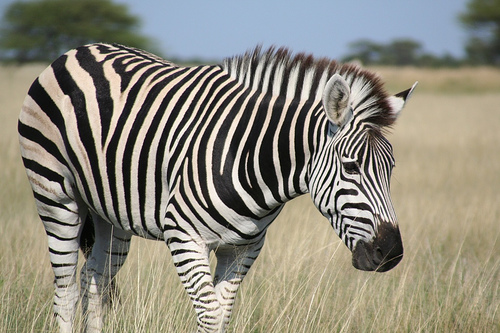
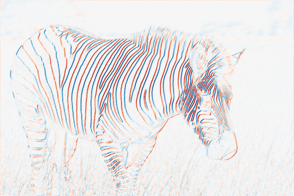
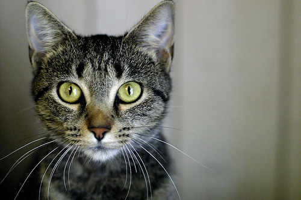
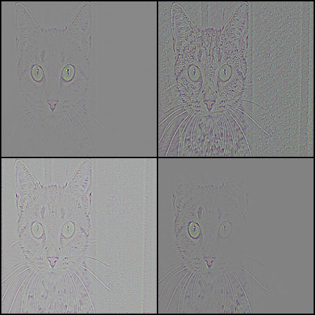
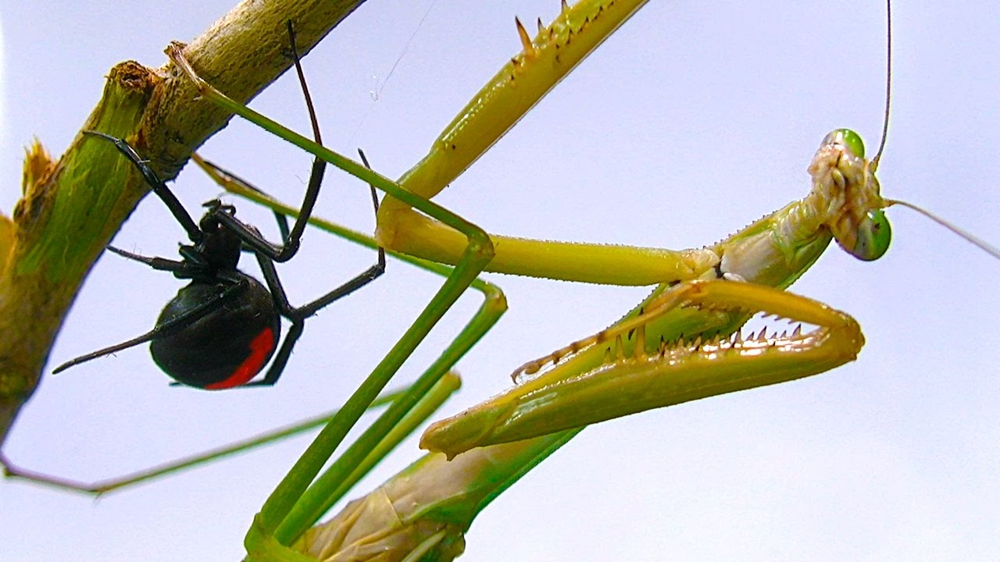
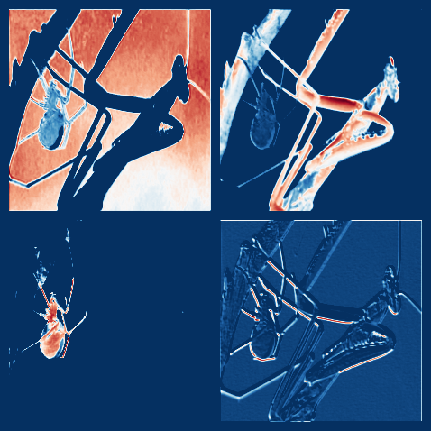

# CNN Visualization (Implemented with PyTorch)

Various methods to visualize pre-trained Convolution Neural Network (CNN).

## Installation
1. Install dependency libraries.
```bash
pip3 install matplotlib numpy torch torchvision
```
2. Clone repository and install viztools.
```bash
$ git clone https://github.com/kingstonong/viztools-pytorch.git
$ cd viztools-pytorch/
$ pip install .
```

## Activation Value
Visualize the activation value at selected convolution layer and filter. <br />
**Example:**
```python
>>> from viztools import viz_act_val
>>> from test import vgg16
>>> from PIL import Image
>>> import matplotlib.pyplot as plt
>>> import numpy as np
>>> image = np.array(Image.open("examples/zebra.jpg"))
>>> model = vgg16(pretrained=True)
>>> # layer indexing convention: '<nn.Module>-i>' ('Conv2d-1' means 1st Conv2d layer)
>>> # visualize output of 6th filter of 1st convolution layer
>>> activation_value = viz_act_val(image, model, "Conv2d-1", 5)
>>> activation_value.shape
(333, 500)
>>> # to visualize in heatmap, use matplotlib
>>> plt.imshow(activation_value, cmap=plt.cm.RdBu_r)
>>> plt.show()
```
**Sample Output:**
<div style="height: 363px;" align="center">
  <div style="float: left; padding-left: 10px;"><br />Figure 1: Input image</div>
  <div style="float: right; padding-right: 10px;"><br />Figure 2: Activation Value Heatmap</div>
</div>

## CNN Filter Visualization
Optimize random image with respect to targeted layer and filter/feature. <br />
**Example:**
```python
>>> from viztools import viz_cnn_filter
>>> cnn_filter = viz_cnn_filter(model, "Conv2d-2", 15) 
>>> cnn_filter.shape
(224, 224, 3)
>>> plt.imshow(cnn_filter)
>>> plt.show()
```
**Sample Output:**
<div align="center" style="height: 630px;">
  <div><br />Figure 3: Conv2 of VGG16</div>
</div>

## Guided Backpropagation
Visualize the gradient backpropagated from target layer and filter/feature when forward passing an image.
 <br />
**Example:**
```python
>>> from viztools import viz_back_prop
>>> from torchvision.transforms import Resize
>>> image = np.array(Resize([224, 224])(Image.open("examples/cat.jpg")))
>>> gradient = viz_back_prop(image, model, "Linear-3", 281)
>>> gradient.shape
(224, 224, 3)
>>> plt.imshow(gradient)
>>> plt.show()
```
**Sample Output:**
<div style="height: 254px;" align="center">
  <div style="float: left; padding-left: 10px;"><br />Figure 4: Input image</div>
  <div style="float: right; padding-right: 10px;"><br />Figure 5: Gradient Backpropagated from different filter</div>
</div>

## Others
### `viztools.util.combine_images`
Combine a list of numpy images to form a big square image.<br />
**Example:**
```python
>>> from viztools.util import combine_images
>>> image = np.array(Resize([224, 224])(Image.open("examples/spider_n_mantis.jpg")))
>>> gradient = []
>>> for i in [24, 16, 44, 56]:
...     gradient.append(viz_act_val(image, model, "ReLU-1", i))
... 
>>> gradient = combine_images(gradient)
>>> plt.imshow(gradient, cmap=plt.cm.RdBu_r)
>>> plt.axis("off")
>>> plt.show()
```
**Sample Output:**
<div style="height: 254px;" align="center">
  <div style="float: left; padding-left: 10px;"><br />Figure 6: Input image</div>
  <div style="float: right; padding-right: 10px;"><br />Figure 7: Activation Value Heatmap of 4 filters</div>
</div>

### `viztools.util.defuse_model`
Parse model and return an `collections.OrderedDict` of all layers.
**Example:**
```python
>>> from viztools.util import defuse_model
>>> from pprint import pprint
>>> layer_dict = defuse_model(model)
>>> pprint(layer_dict)
OrderedDict([('Conv2d-1',
              Conv2d(3, 64, kernel_size=(3, 3), stride=(1, 1), padding=(1, 1))),
             ('ReLU-1', ReLU(inplace)),
             ('Conv2d-2',
              Conv2d(64, 64, kernel_size=(3, 3), stride=(1, 1), padding=(1, 1))),
             ('ReLU-2', ReLU(inplace)),
             ('MaxPool2d-1',
              MaxPool2d(kernel_size=2, stride=2, padding=0, dilation=1, ceil_mode=False)),
             ('Conv2d-3',
              Conv2d(64, 128, kernel_size=(3, 3), stride=(1, 1), padding=(1, 1))),
             ('ReLU-3', ReLU(inplace)),
             ('Conv2d-4',
              Conv2d(128, 128, kernel_size=(3, 3), stride=(1, 1), padding=(1, 1))),
             ('ReLU-4', ReLU(inplace)),
             ('MaxPool2d-2',
              MaxPool2d(kernel_size=2, stride=2, padding=0, dilation=1, ceil_mode=False)),
             ('Conv2d-5',
              Conv2d(128, 256, kernel_size=(3, 3), stride=(1, 1), padding=(1, 1))),
             ('ReLU-5', ReLU(inplace)),
             ('Conv2d-6',
              Conv2d(256, 256, kernel_size=(3, 3), stride=(1, 1), padding=(1, 1))),
             ('ReLU-6', ReLU(inplace)),
             ('Conv2d-7',
              Conv2d(256, 256, kernel_size=(3, 3), stride=(1, 1), padding=(1, 1))),
             ('ReLU-7', ReLU(inplace)),
             ('MaxPool2d-3',
              MaxPool2d(kernel_size=2, stride=2, padding=0, dilation=1, ceil_mode=False)),
             ('Conv2d-8',
              Conv2d(256, 512, kernel_size=(3, 3), stride=(1, 1), padding=(1, 1))),
             ('ReLU-8', ReLU(inplace)),
             ('Conv2d-9',
              Conv2d(512, 512, kernel_size=(3, 3), stride=(1, 1), padding=(1, 1))),
             ('ReLU-9', ReLU(inplace)),
             ('Conv2d-10',
              Conv2d(512, 512, kernel_size=(3, 3), stride=(1, 1), padding=(1, 1))),
             ('ReLU-10', ReLU(inplace)),
             ('MaxPool2d-4',
              MaxPool2d(kernel_size=2, stride=2, padding=0, dilation=1, ceil_mode=False)),
             ('Conv2d-11',
              Conv2d(512, 512, kernel_size=(3, 3), stride=(1, 1), padding=(1, 1))),
             ('ReLU-11', ReLU(inplace)),
             ('Conv2d-12',
              Conv2d(512, 512, kernel_size=(3, 3), stride=(1, 1), padding=(1, 1))),
             ('ReLU-12', ReLU(inplace)),
             ('Conv2d-13',
              Conv2d(512, 512, kernel_size=(3, 3), stride=(1, 1), padding=(1, 1))),
             ('ReLU-13', ReLU(inplace)),
             ('MaxPool2d-5',
              MaxPool2d(kernel_size=2, stride=2, padding=0, dilation=1, ceil_mode=False)),
             ('Linear-1',
              Linear(in_features=25088, out_features=4096, bias=True)),
             ('ReLU-14', ReLU(inplace)),
             ('Dropout-1', Dropout(p=0.5)),
             ('Linear-2',
              Linear(in_features=4096, out_features=4096, bias=True)),
             ('ReLU-15', ReLU(inplace)),
             ('Dropout-2', Dropout(p=0.5)),
             ('Linear-3',
              Linear(in_features=4096, out_features=1000, bias=True))])
```
